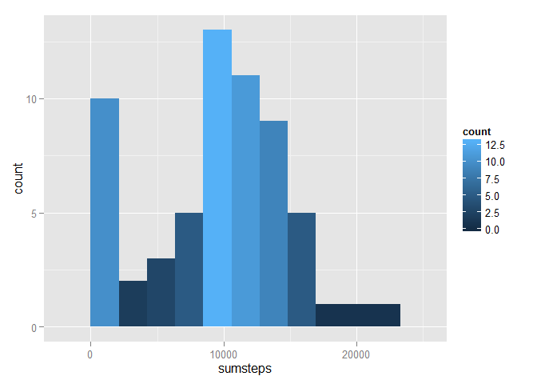

# Reproducible Research: Peer Assessment 1

This file will fork data from rdpeng's Github account, process the data into usable form and then answer several quesions. This assignment makes use of data from a personal activity monitoring device. This device collects data at 5 minute intervals through out the day. The data consists of two months of data from an anonymous individual collected during the months of October and November, 2012 and include the number of steps taken in 5 minute intervals each day.  

The questions we will address are:
1. What is the average number of steps taken per day
2. What is the average daily activity pattern
3. Are their differences in activity patterns between weekdays and weekends


## Loading and preprocessing the data
I've forked the Github repo RepData_PeerAssessment1 from rdpeng to obtain the data. First, I'll unzip the file activity.zip and load the data into an R data frame named 'data' and take a quick peek at the file.


```r
setwd("~/DataScienceCoursera/ReproRes/RepData_PeerAssessment1")
print(date())
```

```
## [1] "Mon Feb 09 18:04:43 2015"
```

```r
unzip("activity.zip", exdir=".")
data <- read.csv("activity.csv", header=T)
summary(data)
```

```
##      steps                date          interval     
##  Min.   :  0.00   2012-10-01:  288   Min.   :   0.0  
##  1st Qu.:  0.00   2012-10-02:  288   1st Qu.: 588.8  
##  Median :  0.00   2012-10-03:  288   Median :1177.5  
##  Mean   : 37.38   2012-10-04:  288   Mean   :1177.5  
##  3rd Qu.: 12.00   2012-10-05:  288   3rd Qu.:1766.2  
##  Max.   :806.00   2012-10-06:  288   Max.   :2355.0  
##  NA's   :2304     (Other)   :15840
```


```r
str(data)
```

```
## 'data.frame':	17568 obs. of  3 variables:
##  $ steps   : int  NA NA NA NA NA NA NA NA NA NA ...
##  $ date    : Factor w/ 61 levels "2012-10-01","2012-10-02",..: 1 1 1 1 1 1 1 1 1 1 ...
##  $ interval: int  0 5 10 15 20 25 30 35 40 45 ...
```
There is not a lot preprocessing necessary to answer our first couple of questions. I'll convert the data column to date format. Other than that we appear to be ready to use the data. I do see that there are quite a bit of NA values for steps. We'll address that later in our analysis.  


```r
data[,2] <- as.Date(data[,2], "%Y-%m-%d")
```

## What is mean total number of steps taken per day?

To create a summary of the total number of steps taken per day I'll load dplyr and use the group_by and summarise functions to create a new data frame totsteps.


```r
head(totsteps)
```

```
##         date   sum
## 1 2012-10-01     0
## 2 2012-10-02   126
## 3 2012-10-03 11352
## 4 2012-10-04 12116
## 5 2012-10-05 13294
## 6 2012-10-06 15420
```

Now I'll show the results on a histogram.


```r
stephist <- hist(totsteps$sum,
                 breaks=5,
                 col="light blue",
                 main = "Frequency of Total Steps Per Day",
                 xlab = "Total Steps")
```

 


This subject appears to take many more steps than the average of 5,116 for an American - source: [*NY Tmes*](http://well.blogs.nytimes.com/2010/10/19/the-pedometer-test-americans-take-fewer-steps/?_r=0). In fact, this subject took an average of **9354.2295082** steps each day with a median of **10395** steps.

## What is the average daily activity pattern?


## Imputing missing values


## Are there differences in activity patterns between weekdays and weekends?
