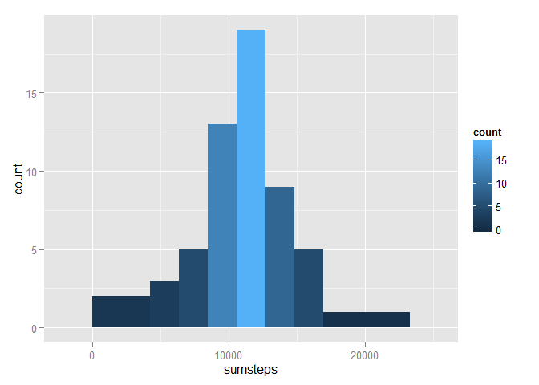
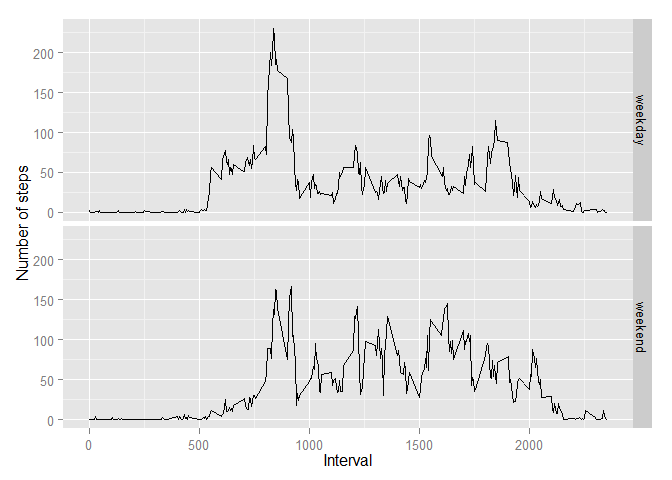

# Reproducible Research: Peer Assessment 1
Casey Privette  

This file will fork data from rdpeng's Github account, process the data into usable form and then answer several quesions. This assignment makes use of data from a personal activity monitoring device. This device collects data at 5 minute intervals through out the day. The data consists of two months of data from an anonymous individual collected during the months of October and November, 2012 and include the number of steps taken in 5 minute intervals each day.  

The questions we will address are:
1. What is the average number of steps taken per day
2. What is the average daily activity pattern
3. Are their differences in activity patterns between weekdays and weekends


## Loading and preprocessing the data
I've forked the Github repo RepData_PeerAssessment1 from rdpeng to obtain the data. First, I'll unzip the file activity.zip and load the data into an R data frame named 'data' and take a quick peek at the file.


```r
setwd("~/DataScienceCoursera/ReproRes/RepData_PeerAssessment1")
print(date())
```

```
## [1] "Mon Feb 09 18:04:43 2015"
```

```r
unzip("activity.zip", exdir=".")
data <- read.csv("activity.csv", header=T)
summary(data)
```

```
##      steps                date          interval     
##  Min.   :  0.00   2012-10-01:  288   Min.   :   0.0  
##  1st Qu.:  0.00   2012-10-02:  288   1st Qu.: 588.8  
##  Median :  0.00   2012-10-03:  288   Median :1177.5  
##  Mean   : 37.38   2012-10-04:  288   Mean   :1177.5  
##  3rd Qu.: 12.00   2012-10-05:  288   3rd Qu.:1766.2  
##  Max.   :806.00   2012-10-06:  288   Max.   :2355.0  
##  NA's   :2304     (Other)   :15840
```


```r
str(data)
```

```
## 'data.frame':	17568 obs. of  3 variables:
##  $ steps   : int  NA NA NA NA NA NA NA NA NA NA ...
##  $ date    : Factor w/ 61 levels "2012-10-01","2012-10-02",..: 1 1 1 1 1 1 1 1 1 1 ...
##  $ interval: int  0 5 10 15 20 25 30 35 40 45 ...
```
There is not a lot preprocessing necessary to answer our first couple of questions. I'll convert the data column to date format. Other than that we appear to be ready to use the data. I do see that there are quite a bit of NA values for steps. We'll address that later in our analysis.  


```r
data[,2] <- as.Date(data[,2], "%Y-%m-%d")
```

## What is mean total number of steps taken per day?

To create a summary of the total number of steps taken per day I'll load dplyr and use the group_by and summarise functions to create a new data frame totsteps.


```r
require(dplyr)
totsteps <- data %>%
      group_by(date) %>%
      summarise(sum=sum(steps, na.rm=TRUE))
```

Now I'll show the results on a histogram.


```r
stephist <- hist(totsteps$sum,
                 breaks=5,
                 col="light blue",
                 main = "Frequency of Total Steps Per Day",
                 xlab = "Total Steps")
```

 


```r
mean <- mean(totsteps$sum)
median <- median(totsteps$sum)
mean <- format(mean, digits=2)
median <- format(median, digits=2)
```
####Mean and median number of steps
This subject took an average of **9354** steps each day with a median of **10395** steps. This is many more steps than the average of 5,116 for an American - source: [*NY Tmes*](http://well.blogs.nytimes.com/2010/10/19/the-pedometer-test-americans-take-fewer-steps/?_r=0).  

## What is the average daily activity pattern?

Now I'll take a look the average number of steps across all days by summarizing the number of steps for each interval over all days again using the group_by and summarise functions in dplyr. I'll then plot the table in a time-series graph using the base plotting system in R.  

```r
intervalavg <- data %>%
      group_by(interval) %>%
      summarise(avg=mean(steps, na.rm=TRUE))

plot(intervalavg$interval,
     intervalavg$avg,
     type="l",
     col="purple",
     lwd=2,
     main="Average Steps For Each 5-Minute Interval",
     xlab="Average Steps",
     ylab="Interval")
```

 

####What time do the most steps tend to occur? 

```r
max <- max(intervalavg$avg)
row <- intervalavg[intervalavg$avg == max,]
max <- format(max, digits=6)
```
The maximum average steps (**206.17**) occur at the **835** interval.  

## Imputing missing values

```r
na <- sum(is.na(data$steps))
```
Now I'll address the NA values in the raw data. **There are 2304 rows with missing values for the steps variable.** We'll take the averages we calculated for each 5-minute interval above and use those as an estimate of the missing values. I'll write a short for loop to replace the NA's.


```r
for (i in 1:nrow(data)) {
      if (is.na(data[i,1]) == TRUE) {
            x <- data[i,3]
            y <- filter(intervalavg, interval == x)
            data[i,1] <- y[1,2]
      } else next
}
summary(data)
```

```
##      steps             date               interval     
##  Min.   :  0.00   Min.   :2012-10-01   Min.   :   0.0  
##  1st Qu.:  0.00   1st Qu.:2012-10-16   1st Qu.: 588.8  
##  Median :  0.00   Median :2012-10-31   Median :1177.5  
##  Mean   : 37.38   Mean   :2012-10-31   Mean   :1177.5  
##  3rd Qu.: 27.00   3rd Qu.:2012-11-15   3rd Qu.:1766.2  
##  Max.   :806.00   Max.   :2012-11-30   Max.   :2355.0
```

Now I'll rerun the code to summarize the total steps per day and make a new histogram to show the results.


```r
totsteps2 <- data %>%
      group_by(date) %>%
      summarise(sum=sum(steps))

hist(totsteps2$sum,
                 breaks=5,
                 col="dark blue",
                 main = "Frequency of Total Steps Per Day",
                 xlab = "Total Steps")
```

 

####Mean and median number of steps

```r
mean2 <- mean(totsteps2$sum)
median2 <- median(totsteps2$sum)
mean2 <- format(mean2, digits=2)
median2 <- format(median2, digits=2)
```
By imputing the missing values the subject took an average of **10766** steps each day with a median of **10766** steps. As would be expected this is an increase over the mean and median calculated when excluding missing values.

## Are there differences in activity patterns between weekdays and weekends?

Finally, I'll take a look to see if there are any differences in the steps per interval between weekends and weekdays. First I'll create a new variable day that indicates the day of the week.

```r
data <- mutate(data, day=weekdays(date))
```

Then I'll substitute all weekdays with the text weekday and weekends with the text weekend.


```r
data[,"day"] <- gsub("Saturday", "weekend", data$day)
data[,"day"] <- gsub("Sunday", "weekend", data$day)
data[,"day"] <- gsub("Monday", "weekday", data$day)
data[,"day"] <- gsub("Tuesday", "weekday", data$day)
data[,"day"] <- gsub("Wednesday", "weekday", data$day)
data[,"day"] <- gsub("Thursday", "weekday", data$day)
data[,"day"] <- gsub("Friday", "weekday", data$day)
```

To get the average 5-minute interval steps by weekday or weekend, I'll use dplyr's group_by and summarise functions.


```r
byday <- data %>%
      group_by(day, interval) %>%
      summarise(avg=mean(steps))
```

Now I'll plot the data in a time-series using the ggplot2 package with two panels to see if there are differences in the pattern for weekdays and weekends.

```r
library(ggplot2)
qplot(interval, avg, data=byday, facets= day ~ .,
      geom="line", ylab="Number of steps", xlab="Interval")
```

 
